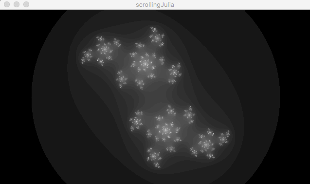

# Complex Analysis
Spring 2017 Compex Analysis class.

- "**spiralPlotter_v1_1**": A small app demonstrating the scaling effects of the golden ratio and [its difficulty to approximate](https://en.wikipedia.org/wiki/Golden_ratio#Other_properties).

- "**julia**": A looping Julia set with iterations denoted by color (runs slowly).

- "**scrolling_julia**": A looping grayscale Julia set with iterations denoted by level (runs quickly).

- "**babyBrot**": A simple grayscale mandelbrot with primitive zooming (x=zoom out, c=zoom in, r=reset). Drag to pan.

- "**colorizedMandelbrot**": A colorized mandelbrot with better zooming (hold shift and drag to zoom). Drag to pan.

- "**grayscaleMandelbrot**": A static grayscale mandelbrot.

